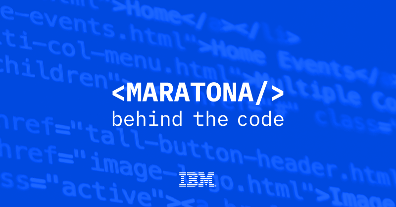

# Maratona IBM - Behind The Code 2019 

Resolução dos desafios proposto na Maratona IBM - Behind the code 2019.

 

Os diretórios contidos neste repositório contém arquivos que foram essenciais para realizar a maioria dos desafios.

## Recursos ofertados

Todos os recursos (hospedagem, RAM, aplicações, etc ) ofertados na [IBM Cloud](https://cloud.ibm.com/login) possuiam limitações de uso, sendo necessário a desativação de alguns serviços gerados para liberar esses recursos, tornando possível a conclusão de outros desafios, bem como sua submissão.

## Validade dos serviços

Os serviços listados abaixos foram submetidos na plataforma IBM e validados. Entretanto, o funcionamento de qualquer serviço pode ser descontinuado sem aviso prévio por parte da IBM, tornando inválida a requisição dos links.

<table>
 <tr>
  <td>
   
<b>Desafio #1 - GPA</b>

[Desafio](https://github.com/maratonadev/desafio-1/) 
[Serviço](https://104180-desafio1-behindthecode.mybluemix.net/)

<b>Desafio #5 - BRF</b>

[Desafio](https://github.com/maratonadev/desafio-5/) 
[Serviço](https://104180-desafio5-behindthecode.mybluemix.net/)

 </td>
  <td>

<b>Desafio #2 - FIAP</b>

[Desafio](https://github.com/maratonadev/desafio-2/) 
[Serviço](https://104180-desafio2-behindthecode.mybluemix.net/)

<b>Desafio #6 - INGRAM</b>

[Desafio](https://github.com/maratonadev/desafio-6/) 
[Serviço](https://104180-desafio6-behindthecode.mybluemix.net/)

 </td>
  <td>

<b>Desafio #3 - UNIJÁ</b>

[Desafio](https://github.com/maratonadev/desafio-3/) 
[Serviço](https://104180-desafio3-behindthecode.mybluemix.net/)

<b>Desafio #7 - BANCO ORIGINAL</b>

[Desafio](https://github.com/maratonadev/desafio-7/) 
[Serviço](https://104180-desafio7-behindthecode.mybluemix.net/)

 </td>
  <td>

<b>Desafio #4 - BOTICÁRIO</b>

[Desafio](https://github.com/maratonadev/desafio-4/) 
[Serviço](https://104180-desafio4-behindthecode.mybluemix.net/)

<b>Desafio #8 - SAINT PAUL & LIT</b>

[Desafio](https://github.com/maratonadev/desafio-8/) 
Este desafio não gerou serviço.

 </td>  
</tr>
</table>
